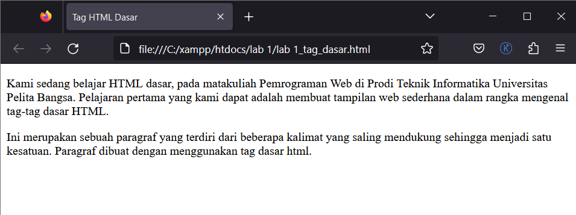
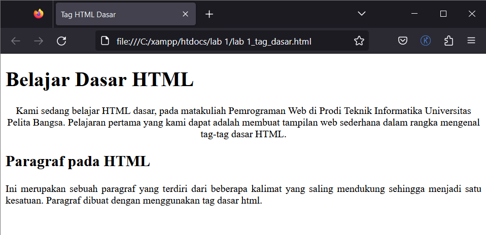
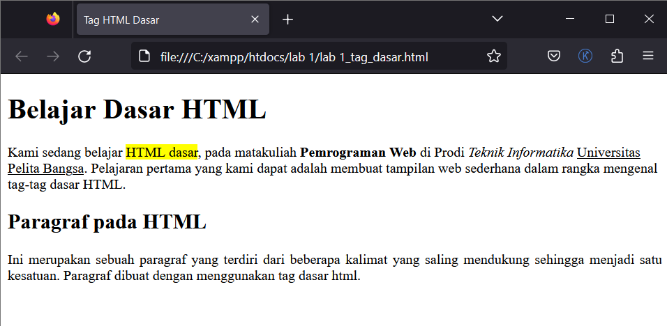
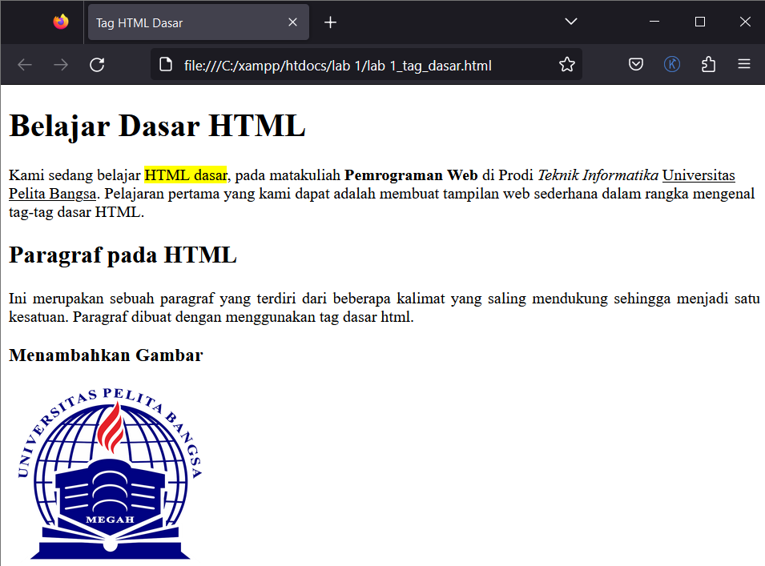
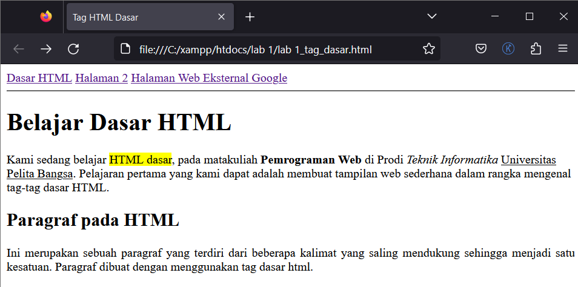

#Praktikum_web_1

`Nama  : Faizah Via Fadhillah`

`Nim   : 312210460`

`Kelas : TI22.A4`

## Pengertian HTML

        HTML (Hypertest Markup Language) merupakan bahasa markup yang digunakan untuk membuat sebuah halaman web dan menampilkan berbagai informasi di dalam sebuah browser. HTML berupa kode-kode tag yang menginstruksikan browser untuk menghasilkan tampilan sesuai dengan yang diinginkan. HTML memiliki struktur yang fleksibel, tanpa lojik serta toleran terhadap kesalahan. Standar minimal dari dokumen HTML terdiri dari: 

    1. Document Type Declaration (DTD)
    2. Document Header
    3. Document Body

    ```html
    <!DOCTYPE html>
    <html lang="en">
    <head>
        <meta charset="UTF-8">
        <meta name="viewport" content="width=device-width, initial-scale=1.0">
        <title>...</title>
    </head>
    <body>
        
    </body>
    </html>
    ```

# Praktikum 1

1. Membuat Paragraf

        Paragraf merupakan kumpulan dari beberapa kalimat. Pada dokumen web, paragraf biasanya digunakan untuk menampilkan teks atau artikel Paragraf pada dokumen HTML dibuat dengan tag <p>

    Script:

    ```html
    <!DOCTYPE html>
    <html lang="en">
    <head>
        <meta charset="UTF-8">
        <meta name="viewport" content="width=device-width, initial-scale=1.0">
        <title>Tag HTML Dasar</title>
    </head>
    <body>
        <!-- Ini adalah paragraf pertama -->

            <p>Kami sedang belajar HTML dasar, pada matakuliah Pemrograman Web di Prodi
            Teknik Informatika Universitas Pelita Bangsa. Pelajaran pertama yang kami dapat
            adalah membuat tampilan web sederhana dalam rangka mengenal tag-tag dasar
            HTML.</p>
        <!-- Ini adalah paragraf kedua -->

            <p>Ini merupakan sebuah paragraf yang terdiri dari beberapa kalimat yang saling
            mendukung sehingga menjadi satu kesatuan. Paragraf dibuat dengan menggunakan
            tag dasar html.</p>
    </body>
    </html>
    ```

    Output:

    


2. Menambahkan Judul

        Heading merupakan sebuah judul yang biasanya digunakan pada sebuah halaman artikel pada web. Atau terkadang dibeberapa bagian dari halaman web. Judul atau heading pada dokumen HTML dapat dibuat dengan menggunakan tag <h1> sampai <h6>. Tag <h1> merupakan judul pada lever pertama, kemudian level berikutnya atau sub judul pada tag <h2> dan seterusnya sampai tag <h6>.

    Script:

    ```html
    <!DOCTYPE html>
    <html lang="en">
    <head>
        <meta charset="UTF-8">
        <meta name="viewport" content="width=device-width, initial-scale=1.0">
        <title>Tag HTML Dasar</title>
    </head>
    <body>
        <!-- judul paragraf pertama -->

        <h1>Belajar Dasar HTML</h1>

        <!-- judul paragraf kedua -->

        <h2>Paragraf pada HTML</h2>
    </body>
    </html>
    ```

    Output:

    


3. Memformat teks

     Ada beberapa tag yang dapat digunakan untuk memformat teks pada paragraf. Diantaranya adalah sebagai berikut:

    - <b>      (Bold text)
    - <strong> ( Important text)
    - <i>      ( Italic text), dsb...

    Script:

    ```html
    <!DOCTYPE html>
    <html lang="en">
    <head>
        <meta charset="UTF-8">
        <meta name="viewport" content="width=device-width, initial-scale=1.0">
        <title>Tag HTML Dasar</title>
    </head>
    <body>
        <!-- Ini adalah paragraf pertama -->

        <h1>Belajar Dasar HTML</h1>
        <p>Kami sedang belajar <span style="background-color:yellow;">HTML dasar</span>, pada matakuliah <b>Pemrograman Web</b> di Prodi <i>Teknik Informatika</i> <u>Universitas Pelita Bangsa</u>. 
            Pelajaran pertama yang kami dapat adalah membuat tampilan web sederhana dalam rangka mengenal tag-tag dasar HTML.</p> 

        <!-- Ini adalah paragraf kedua-->

        <h2>Paragraf pada HTML</h2>
        <p align="justify">Ini merupakan sebuah paragraf yang terdiri dari beberapa kalimat yang saling
            mendukung sehingga menjadi satu kesatuan. Paragraf dibuat dengan menggunakan tag dasar html.</p> 

    </body>
    </html>
    ```

    Output:

    


4. Menyisipkan Gambar

        Image atau gambar dapat disisipkan kedalam halaman web. HTML menyediakan tag khusus untuk dapat menampilkan gambar. Tag yang digunakan untuk menampilkan gambar adalah  dengan atribut src sebagai URL atau Path file gambar berada. Tag ini dapat memuat gambar dengan berbagai jenis ekstensi file gambar.

    Script:

    ```html
    <!DOCTYPE html>
    <html lang="en">
    <head>
        <meta charset="UTF-8">
        <meta name="viewport" content="width=device-width, initial-scale=1.0">
        <title>Tag HTML Dasar</title>
    </head>
    <body>
        <!-- sub judul paragraf -->

        <h3>Menambahkan Gambar</h3> 

        <!-- menambahkan gambar pada dokumen -->

          

    </body>
    </html>
    ```

    Output:

    


5. Menambahkan Hyperlink

        Link atau Hyperlink merupakan elemen HTML yang berfungsi untuk menghubungkan satu halaman web dengan halaman web yang lain, baik internal maupun eksternal. Link juga dapat menghubungkan beberapa bagian pada halaman yang sama atau disebut sebagai Anchor. Elemen link ini dapat diklik sehingga akan membuka halaman atau bagian sesuai dengan URL yang diberikan pada link tersebut. Untuk membuat Hyperlink atau Anchor menggunakan tag <a> dengan menambahkan atribut href sebagai penentu URL yang dimaksud.

    Script:

        ```html
        <!DOCTYPE html>
        <html lang="en">
        <head>
            <meta charset="UTF-8">
            <meta name="viewport" content="width=device-width, initial-scale=1.0">
            <title>Tag HTML Dasar</title>
        </head>
        <body>
            <!-- menambahkan link navigasi -->

            <nav>
                <a href="lab 1_tag_dasar.html">Dasar HTML</a>
                <a href="lab 1_halaman2.html">Halaman 2</a>
                <a href="http://www.google.com">Halaman Web Eksternal Google</a>
            </nav>

        </body>
        </html>
        ```

    Output:

    


# Pertanyaan

* Iya, akan terjadi error ketika kita melakukan kesalahan pada penulisan tag.

* Tag `<P>` atau paragraf merupakan kumpulan dari beberapa kalimat Pada dokumen web, paragraf biasanya
digunakan untuk menampilkan teks atau artikel. sedangkan tag `<br>` atau break-line merupakan tag html yang digunakan untuk berpindah ke baris selanjutnya.

* Atribut `title` digunakan untuk menyediakan informasi tambahan tentang gambar saat pengguna mengarahkan kursor mouse ke gambar tersebut (hover). sedangkan atribut `alt` digunakan untuk menyediakan teks alternatif untuk gambar.

* Untuk mengatur ukuran gambar, digunakan atribut width dan height. Agar tampilan gambar proporsional sebaiknya mengisi kedua atribut `width` dan `height` akan menjaga proporsionalitas gambar saat Anda mengubah ukurannya. Ini berarti gambar akan terlihat sama seperti aslinya dalam hal perbandingan lebar dan tinggi.

* Atribut `target` pada elemen `<a>` (link) digunakan untuk mengontrol cara tautan (link) akan dibuka atau ditampilkan saat pengguna mengkliknya. 

    1. Saat kita mengatur `target="_blank"`, tautan akan membuka halaman atau dokumen baru dalam jendela atau tab browser yang baru. Ini akan menggantikan halaman web saat ini, sehingga pengguna dapat kembali ke halaman asal dengan menutup tab atau jendela baru yang dibuka. 

    2. Saat kita tidak menentukan `target` atau menggunakan `target="_self"`, tautan akan membuka halaman atau dokumen baru dalam jendela atau tab yang sama di mana tautan tersebut berada. Ini akan menggantikan konten halaman web saat ini dengan konten yang baru.

    3. Saat kita mengatur `target="_top"`, tautan akan membuka halaman atau dokumen baru dalam jendela atau tab yang sama seperti `_self`, tetapi jika tautan tersebut ada dalam bingkai (frame), maka halaman baru akan menggantikan seluruh bingkai (frame) tersebut. Ini digunakan ketika kita ingin keluar dari semua bingkai dan menampilkan halaman baru di jendela atau tab yang utama.

    4. Saat kita mengatur `target="_parent"`, tautan akan membuka halaman atau dokumen baru dalam jendela atau tab yang sama seperti `_self`, tetapi jika tautan tersebut ada dalam bingkai (frame), maka halaman baru akan menggantikan bingkai yang lebih tinggi atau "induk" dari bingkai tempat tautan tersebut ada. Ini digunakan ketika Anda ingin halaman baru menggantikan bingkai yang mengandung tautan tersebut, bukan seluruh bingkai.

